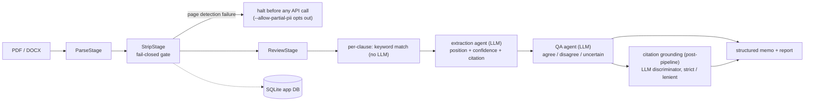

# Architecture

openreview-cli is a local-first, privacy-first contract review automation tool: an async stage pipeline, an AI Gateway abstraction over 17 providers, SQLite storage, per-document retrieval indexes, and a spec-driven development process that has produced 33 specs. This document describes how the pieces fit, with honest limitations where the implementation is simpler than the ambition.

## Dual interface

The tool serves two audiences through the same codebase:

- **Human CLI/TUI:** `openreview precheck review contract.pdf` (Typer CLI) or no-args → Textual TUI. Rich formatting, progress bars, interactive prompts.
- **Agent/programmatic API:** every module is independently importable (`from openreview_cli.parsing.stream import parse_document`, `from openreview_cli.review.extraction import extract_clause`, etc.). CLI supports `--format json` / `--memo-format json --output <path>` for structured output. The benchmark runner (`BenchmarkRunner`) and pipeline runner (`run_review`) are Python-callable. Non-zero exit codes signal failures for automation.

- [Dual interface](#dual-interface)
- [Pipeline](#pipeline)
- [Model routing](#model-routing)
- [Data flow and SQLite's two roles](#data-flow-and-sqlites-two-roles)
- [AI Gateway](#ai-gateway)
- [Retrieval and chunking](#retrieval-and-chunking)
- [Negotiation, comparison, graph](#negotiation-comparison-graph)
- [Prompt management](#prompt-management)
- [Spec-driven development](#spec-driven-development)
- [Honest limitations](#honest-limitations)

## Pipeline

The pipeline is an async sequential framework (`pipeline/base.py`: `Stage` ABC; `pipeline/runner.py`: `Pipeline` runner). Stages:

1. **ParseStage** (critical): PyMuPDF reads the PDF page by page (the full PDF is not loaded at once). The wired `ParseStage` calls the materializing `parse_document()`, which collects the whole clause list (all clause text) in memory; the generator `stream_clauses()` in the same module streams clause by clause but has no caller in the shipped package (only the CUAD benchmark script and the parser tests). DOCX via python-docx. Clause detection is heuristic: 7 regex header patterns plus nupunkt sentence segmentation (lazy, one-time model load per process see [BENCHMARKS.md](BENCHMARKS.md) for the measured cost). Corrupt/empty/password detection (`OPENREVIEW_PDF_PASSWORD`). Parsing also flags non-English and broken-glyph ("tofu") text: `parse_document()` runs `annotate_clauses`, which sets `Clause.is_non_english` (the PII engine then keeps only score-1.0 regex recognizer hits for that clause — NER still runs, but no NER-derived entity survives) and records non-English/tofu findings in `Document.warnings`. Document metadata is extracted best-effort: `author`/`title` from PDF metadata and DOCX core properties, `company` from DOCX `docProps/app.xml` (no company field for PDF).
2. **StripStage**: Presidio PII engine with spaCy `en_core_web_lg` plus 6 custom regex recognizers (AMOUNT, TAX_ID, ID_DOCUMENT, REG_NUMBER, PHONE_NUMBER, ACCT). **Fail-closed by default**: any page-detection failure raises `PartialProcessingError`; the pipeline converts it to `CriticalStageError` and halts before any external API call. `--allow-partial-pii` opts out. A 50-char overlap buffer catches boundary-crossing PII. Entities become `[PARTY_A]`-style placeholders; the reversible mapping is encrypted with Fernet (AES-128-CBC + HMAC), key derived via HKDF-SHA256(document_hash + salt), written chmod 600 to `{data_dir}/reviews/{document_hash[:12]}/pii_map.enc`. The `pii_audit_trail` table is the canonical audit sink: one row is written on every strip, and every row is governed like the rest of the PII data (`pii delete <prefix>` removes it, `pii cleanup` expires it after the retention window, `pii list --all` lists it while the default `pii list` does not). A `pii_audit.json` file is written only on the legacy `ReviewCommand` path.
3. **ReviewStage**: multi-agent review means separate LLM calls per clause, not agent classes keyword category match (no LLM) → extraction agent (LLM, JSON: position, confidence, citation) → QA agent (LLM, verdict agree/disagree/uncertain, amber flag). Playbook selection precedence: DB id > file path > bundled (24 YAMLs: `precheck-nda-v1`, `saas-license-v1`, `hirecheck-v1`, …). Findings use a 3-position model: Preferred / Acceptable / Walkaway (plus an Uncertain state).
4. **Citation grounding** (post-pipeline): an LLM discriminator verifies each claim against the source (strict/lenient modes). A failure here never kills the review.

The runner emits per-stage progress events and samples memory via tracemalloc when tracing is enabled (the benchmark harness starts it; the review path does not); before each stage the coordinator compares current absolute traced memory against the recovery threshold (80% of the 100 MB budget by default, `memory_threshold_pct` 80), rather than a per-stage delta. A recovery coordinator selects among 5 strategies by error category: `auto_retry` (exponential backoff), `provider_fallback`, `graceful_degradation`, `stage_isolation`, `user_guided_recovery`; recovery state persists to the `recovery_state` table.

> Note on stage count: the shipped review runner wires 3 stages (Parse → Strip → Review). Spec 018 ("5-Stage Async Pipeline Framework") describes a broader framework example; the Chunk/Retrieve/Generate adapters exist but are not wired into `run_review`.

## Model routing

All model calls go through the AI Gateway (litellm): `chat → completion`, `embed → embedding`, `rerank → rerank`. Six slots route per task:

| Slot | Default (local, fully offline) | Cloud examples | Why |
|---|---|---|---|
| reasoning | `qwen3:8b` (Ollama) | `gpt-4o`, `claude-sonnet-latest`, `gemini-2.0-flash`, `deepseek-chat` | highest-capability local model; hard reasoning stays local by default |
| extraction | `qwen3:4b` (Ollama) | `gpt-4o-mini`, `claude-haiku-latest` | smaller/faster, enough for structured JSON extraction |
| embedding | `nomic-embed-text` (Ollama) | `text-embedding-3-small`, `text-embedding-004` | primary-only: no embedding fallback (fallback model would change vector space) |
| reranking | `qwen3-reranker-0.6b` (Ollama) | provider rerank APIs | primary-only; disabled by default (see limitations) |
| grounding | `qwen3:8b` (Ollama) | | claim-vs-source verification |
| graph | `qwen3:8b` (Ollama) | | clause-graph health scoring and clustering |

Privacy tier routing (`maximum` / `balanced` / `performance`) gates which providers a slot may use; `maximum` blocks cloud entirely. Fallback: 2 retries, 60 s timeout. Per-slot backup (fallback) models are optional and user-set, via `openreview gateway fallback <slot> <model>|--clear`, the CLI setup wizard, and the TUI wizard; none is configured by default and none is required to run. `embedding`/`reranking` are primary-only and never take a backup.

## Data flow and SQLite's two roles

SQLite serves two distinct roles:

1. **App database** a single `openreview.db` in the platformdirs data dir (the review path also keeps a `recovery.db` for recovery state). 13 migrations (001–014, no 012), 19 core tables: `clients`, `reviews`, `review_reports`, `review_diffs`, `cost_logs`, `pii_cache`, `pii_audit_trail`, `prompt_versions`, `prompt_bindings`, `playbook_versions`, `playbook_meta`, `benchmark_runs`/`results`/`baselines`, contract graph (`graph_nodes`/`edges`/`meta`), `recovery_state`, `schema_version`, plus a runtime-created `comparison_history` used by bilateral comparison.
2. **Per-document retrieval indexes**: separate SQLite files at `{data_dir}/indexes/{document_id[:32]}.db`, isolating vector/FTS data per contract. The stem is the `.ndax` source's `document_id` (the SHA-256 file digest is used only as a fallback when the file carries none).

Pipeline flow: parse → strip → review writes cost rows to the app DB (the TUI additionally persists review reports; the CLI review path does not write `reviews`/`review_reports`); retrieval reads from the per-doc index DB; the encrypted PII map and audit file live next to the review in `{data_dir}/reviews/{id}/`.

## AI Gateway

- **Single abstraction**: litellm for chat, embedding, and rerank calls one surface over 17 providers, 27 bundled models in `models.json` (openai, anthropic, google, ollama with base URL localhost:11434, openrouter, cohere, huggingface, deepseek, qwen, minimax, voyage, moonshot, mistral, zai; bedrock/azure/vertex supported via multi-field credentials, spec 034). `openreview gateway models <provider>` merges locally discovered Ollama models into the freshly loaded registry (`--no-discover` opts out); discovered models are never persisted.
- **Fallback & streaming**: 2 retries default, 60 s timeout, optional per-slot backup model (unset by default); streaming chat with 15 s connect / 45 s idle timeouts.
- **Cost tracking**: tokens from responses → `litellm.completion_cost` → cents → SQLite `cost_logs` (non-fatal on error the guard lives in the gateway callers, not in `cost.py`); configurable per-review/per-day limits (100¢ / 1,000¢ defaults, hard-exit with exit code 6 when exceeded).
- **Privacy**: tier routing per slot. API keys are redacted at one proactive call site (`redact_key`, in the gateway router); the main mechanism is the `RedactingFilter` installed on the root logger's **handlers** (`install_on_root_handlers()`, idempotent per handler), so records propagated from module/child loggers are redacted too. The filter redacts exception text as well, and a key-value regex masks the full key body (not just the `sk-` prefix) before the literal-pattern pass. It attaches only to the handlers present at install time, so a handler added later, or a logger with propagation disabled, is uncovered.
- **Credentials**: multi-field provider credentials (spec 034) are CLI-managed via `openreview gateway provider add`, or interactively via the `openreview gateway setup` wizard, stored in `auth.json` (chmod 600).

## Retrieval and chunking

- **Chunking**: custom RCTS recursive char split on `["\n\n", ". "]` with word-split fallback and merge of undersized chunks; regex tokenizer (explicitly an approximation, not model-aware); defaults 512 tokens / 50 overlap; clause-boundary aware; groups short clauses; flattens tables.
- **Retrieval**: hybrid BM25 + dense + RRF. BM25 via SQLite FTS5 (unicode61, prefix 2–3); dense via gateway embeddings (default `nomic-embed-text`) with a **brute-force cosine scan no vector DB, no ANN**; RRF fusion (k=60). A reranker exists but is disabled by default: its effect on legal text is unmeasured a 26-query pilot found no degradation but was far too small to support any claim. It is opt-in (`--rerank`); when the latest stored validation record shows degradation (`degradation_pp <= 0`) the CLI warns and points at `--force-rerank`, but the reranker still runs and never auto-disables. The 3-consecutive-degradation counter lives in `RetrievalStorage.insert_rerank_validation` (kept), but no shipped path writes `rerank_validation` records, so on a normal install the warning has nothing to fire on. Degrades gracefully to BM25-only when the gateway is unavailable.

## Negotiation, comparison, graph

- **Negotiation** (`openreview negotiate`): pure local NumPy game theory Nash (support enumeration), QRE (logit fixed-point), Level-k (k ≤ 3). **No LLM calls** in this path; assessments are built from playbook heading-match and default positions a simplified local path, not the full review pipeline.
- **Bilateral comparison** (`precheck compare`): experimental. RCBSF 5-dimension divergence taxonomy (category/location/evidence/issue/suggestion), 3-tier heading alignment, LLM comparison agent. Documented accuracy ceiling ≤ 64% F1 (a ceiling recorded in `PRODUCT.md`, not a [BENCHMARKS.md](BENCHMARKS.md) measurement).
- **Contract graph** (`openreview graph`): directed clause graph (`parent_child`, `cross_ref`, `def_ref` edges); 0–100 health score from 5 structural metrics (density, depth, orphan ratio, broken refs, definition coverage); ASCII tree view; graph diff; optional `legal-bert` + HDBSCAN clustering (`--cluster-clauses`, first-time model download).

## Prompt management

Prompts are versioned rows in the app DB (`prompt_versions`, `prompt_bindings`) owned by `PromptStore` (`prompts/store.py`). A prompt has a name and a version history that only grows (each update appends the next version, with content, tags and description), and it can be bound to one of the six gateway slots; `PromptStore.resolve(slot)` returns the bound version's content. The CLI surface is `openreview prompt` (create, update, list, show, delete, diff, bind, unbind, bindings, history, test, export, import, optimize).

The TUI adds a Prompts tab (`tui/tabs/prompts.py`, registered in `tui/app.py`): a filterable list with `+ New prompt`, `+ Import` and `Export all` in the toolbar, plus a selection-gated action row (edit, bind, bindings, test, export, delete). Create and edit share one form screen (`screens/prompt_form.py`); bindings, test, export and import each have their own screen. The export modal covers one prompt (the action row) or the whole library (the `Export all` toolbar button, which needs no selected row). Every TUI action goes through the `tui/domain/prompts.py` wrappers, the only layer that touches `PromptStore`; they translate store and filesystem errors to `ValueError`, so no exception reaches a Textual handler. Import validates through the same `parse_prompts_yaml` the CLI uses (`prompts/io.py`), so the TUI and the CLI cannot disagree about a document.

## Spec-driven development

Development is driven by spec-kit: requirements land as specs in `specs/`, get plans, then implementation. 33 spec directories (001–034; 023 absent), including:

| Spec | Area |
|---|---|
| 001 | Config + storage |
| 002 | Document parsing |
| 003/004 | PII |
| 005 | AI Gateway |
| 007 | Chunking strategy |
| 010 | Benchmark harness |
| 011 | Single-party review 3-agent pipeline |
| 012 | Citation grounding |
| 016 | Hierarchical retrieval (BM25 + dense + RRF) |
| 018 | 5-stage async pipeline framework |
| 020 | Privacy tier routing |
| 025 | Contract graph |
| 026 | Game-theoretic negotiation |
| 032 | Interactive TUI |
| 033 | AI Gateway v2 (fail-safe privacy routing, full provider registry, capability validation, streaming) |
| 034 | Multi-field provider credentials |

Deferred work is tracked in `specs/DEFERRED.md` check it before touching any module with open deferrals.

## Honest limitations

- **Dense retrieval is a brute-force cosine scan** over the per-doc index no vector DB, no ANN. Fine for single contracts; document the ceiling.
- **Regex tokenizer** approximates tokens; chunk sizes are estimates, not model-precise counts.
- **Benchmark harness**: CUAD/MAUD/ContractNLI paths use a mock pipeline by default (real LLM integration deferred); PII benchmarks use the real engine. Hallucination detection is a ROUGE-L lexical-overlap placeholder (EXPERIMENTAL default).
- **`prompt test` (A/B) and `prompt optimize` are roadmap stubs** the prompt storage, versioning, bindings, and YAML import/export are real; the A/B and optimization commands are not shipped features.
- **TUI prompt `test` is not an A/B**: the Prompts tab `test` action validates the prompt and each named version against the store, then reports the same roadmap notice the CLI prints; it never calls a model.
- **TUI prompt list is capped at 100**: `list_prompts_via_tui` requests `per_page=100`, so prompts beyond the first 100 are not shown (the `Export all` modal reports the uncapped total from `count_prompts_via_tui`).
- **Negotiation uses a simplified local path** (heading-match + defaults), not the full review pipeline no LLM, no clause grounding.
- **Bilateral comparison has a documented accuracy ceiling ≤ 64% F1** (recorded in `PRODUCT.md`; not measured in [BENCHMARKS.md](BENCHMARKS.md)) and is experimental.
- **PII audit trail is never empty**: metadata redaction is on by default, so the filename (`FILENAME`, plus `AUTHOR`/`TITLE`/`COMPANY` when present) is always redacted and `entity_count` is at least 1. A document whose body carries no PII therefore still writes the encrypted mapping, `stripped.txt` and the `pii_cache` row; the empty-mapping branch that would skip those artifacts is unreachable under default settings.
- **TUI discipline**: the Textual TUI must never import litellm at module level (lazy gateway via PEP 562 + domain wrappers) keeps TUI startup fast; treat that boundary as load-bearing.
- **Cost/accuracy numbers**: see [BENCHMARKS.md](BENCHMARKS.md) for what was measured this session and what was not.

Back to [README.md](../README.md) (overview) · [BENCHMARKS.md](BENCHMARKS.md) (measured numbers).
